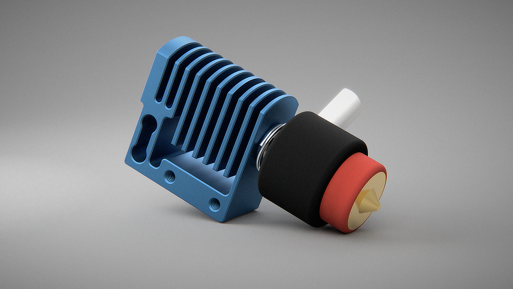

# Amplify Hotend

A hotend with an integrated load cell, for nozzle probing, and a lot more.

## When?

The current release schedule is 'Fairly Soon™' (Q3/Q4 2026).

## Beta Testing

Amplify is currently preparing for a beta.

If you would like to get involved, please join the [Discord](https://discord.gg/HTMsCcjyYD).

## Core Features

- **Never need to calibrate a Z offset ever again**
- No temperature drift in enclosed printers
- Always reads the true zero point of your bed, no scanning the wrong surface
- Best-in-Class precision. Accuracy within 0.8 to 4 microns (0.0008 - 0.004 mm) across 10-100 samples
- Works on **any** surface (smooth/textured PEI, glass, metal, etc.)

## Extra Features

- Native Kalico integration without plugins
- Automatic dirty nozzle detection
- Built-in nozzle cleanup macros, or bring your own gcode
- Ability to read filament pressure build-up, giving you:
  - Clog detection
  - Max flow rate calibration (coming soon)
  - Automatic pressure advance calibration (coming soon)
- Fast bed meshings (single probe per mesh point, combined with adaptive meshing)
- Advanced noise filtering and bowden tube compensation

## Specs

- E3D Revo compatible
- V6/Volcano supported with a Hemera heat break
- Standalone USB module (STM32)
- 320Hz sampling rate
- Average ~100-300g of force applied to the print surface (configurable in Kalico)
- Operating temperatures:
  - PCB rated for 80C max temperature
  - Load cell rated to 150C

## Toolhead Support

Initial support for Amplify will launch with Stealthburner. It will be a community effort to port Amplify to other toolheads. The primary focus is on toolheads for larger Voron machines, such as:

- Stealthburner
- A4T
- Archetype

Want to contribute your own? Join the [Discord](https://discord.gg/HTMsCcjyYD).

## Sponsors

Development on Amplify started way back in February 2024. This project could not have gotten as far as it has without the help of two amazing sponsors:

- LDO Motion
- Fabreeko

## Contributors

So many awesome people have helped me along in this adventure. You know who you are. If you would like to contribute yourself, please connect with the team on the Amplify Discord.

## License

Amplify is fully open source hardware, releasing under the CERN Open Hardware License 2.0 (Weakly Reciprocal).

All source files will be uploaded once the project is out of beta, as they are currently subject to change.
Source will include:

- Bill of Materials
- CAD source including parametric timeline history
- KiCAD PCB design files
- Schematics and technical drawings
- Strain gauge sensor specifications

----

